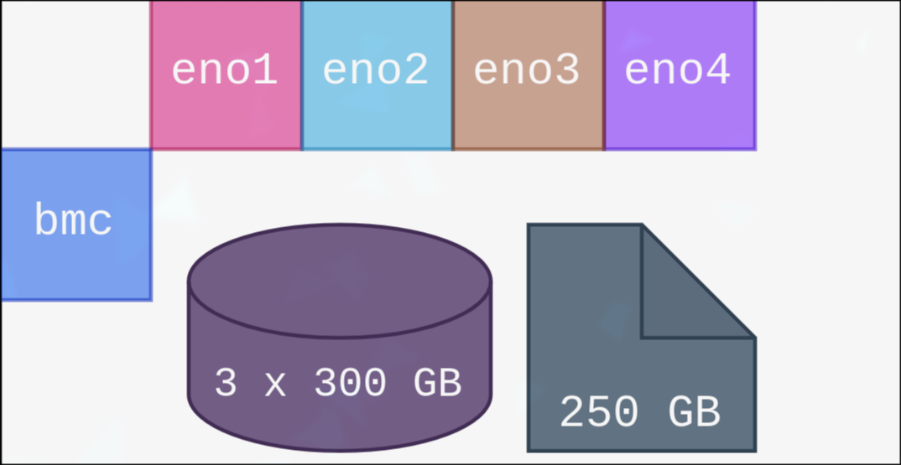

Descrição da infraestrutura atual do servidor
=============================================

Objetivos
---------------------------------------------
Descrever a estrutura **física** e **virtual**, no contexto de **redes**, **aplicações** e **interfaces** do cluster atualmente implementado, que hospeda os atuais serviços ultilizados pelo cloudlabs

Desenvolvimento
--------------------------------------------

### Estrutura física

#### **Cumulus**

[Dell PowerEdge R710](https://servak.com.ua/image/manual/Dell_PowerEdge_R710_SFF_User_Guide_Servak.pdf?srsltid=AfmBOoq9h3PPWscHYkji9yMPHGIjrrSFXP2IGR9QdBPfnDz8xbnb8hLt) [(Manual)](https://dl.dell.com/manuals/all-products/esuprt_ser_stor_net/esuprt_poweredge/poweredge-r710_owner%27s%20manual_en-us.pdf) com Ubuntu Server 22.04
#### **Cirrus**

[Dell PowerEdge R910](https://i.dell.com/sites/csdocuments/Business_solutions_engineering-Docs_Documents/en/poweredge-r910-technical-guide.pdf) com Ubuntu Server 22.04
#### **Compute0**

[Dell PowerEdge R910](https://i.dell.com/sites/csdocuments/Business_solutions_engineering-Docs_Documents/en/poweredge-r910-technical-guide.pdf) com Ubuntu Server 22.04
#### **Compute1**

[Dell PowerEdge R910](https://i.dell.com/sites/csdocuments/Business_solutions_engineering-Docs_Documents/en/poweredge-r910-technical-guide.pdf) com Ubuntu Server 22.04
#### **Incus0**

[Dell PowerEdge R910](https://i.dell.com/sites/csdocuments/Business_solutions_engineering-Docs_Documents/en/poweredge-r910-technical-guide.pdf) com Ubuntu Server 22.04
#### **Incus1**

[Dell PowerEdge R910](https://i.dell.com/sites/csdocuments/Business_solutions_engineering-Docs_Documents/en/poweredge-r910-technical-guide.pdf) com Ubuntu Server 22.04
#### **Incus2**

[Dell PowerEdge R910](https://i.dell.com/sites/csdocuments/Business_solutions_engineering-Docs_Documents/en/poweredge-r910-technical-guide.pdf) com Ubuntu Server 22.04

#### **Chaveador de Máquina**

Todas as maquinas podem ser acessadas pessoalmente por meio de um monitor e teclado disponíveis, fazendo o uso do chaveador TK-801R.

#### **Switch**

O esquema de cores combina com o esquema de cores das máquinas e refere-se ao ligamento físico dos cabos ethernet